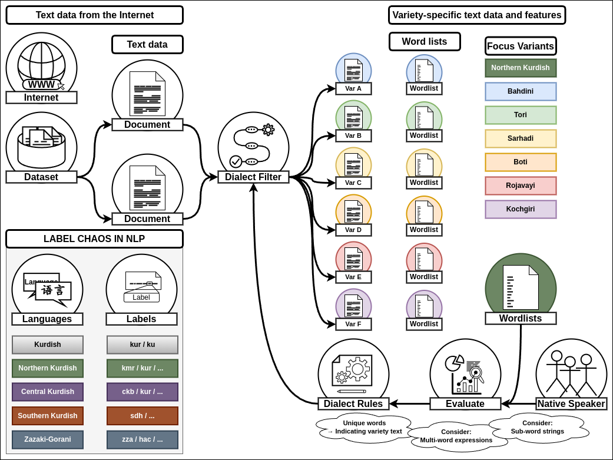

# Kurdish Dialect Filters
Methods and tools to derive clean language data for language varieties from existing corpora by utilizing manually and automatically collected lists of words and features, that characterize a set of focus varieties.

- **Kurdish?** - To this day, the question of "What is or is not Kurdish?" can still be found to be debated by experts around the world. 
In our current approach, we work with a heavily data-driven focus and might end up including language varieties, which (by the majority of people), would not be considered to be part of the Kurdish language. 
However, we believe that each language variety can potentially benefit from our work and we put our trust into the linguistic community to judge and improve our final labels.

- **Dialect?** - Similarly, the question of "What is a dialect?" raises many diverging opinions and no clear consensus has been found yet. 
For many spoken languages there have been made many arguments as to why they should be called "language", or rather "dialect", or rather something else entirely...
Should we use the term "language variety" instead? Maybe- however, we like the sound of  the word "dialect" too much, as to abandon it now!

- **Filters?** - We collect linguistic features for each of the dialects and whenever we find one that is unique (or only observed in a few of the dialects), we can use this as a kind of "filter rule" for recognizing dialects in noisy data. 
What we call "filters" right now, will later be used as perturbation rules in order to transform (or translate) an entire dataset from one dialect to another.

## Overview of Lexicographic Approach as Dialect Filters' First Step

    

# About Languages
- TODO

# About Locations
- TODO

# About Linguistic Features
- TODO

<!-- KURDISH -->
# Kurdish Varieties

## Northern Kurdish

## Central Kurdish

## Southern Kurdish

## Gorani

## Zazaki

## Laki

<!-- INSTALL -->

<!-- METHODS -->

<!-- DATA -->

<!-- ROADMAP -->
## Roadmap

- [x] Collect a comprehensive set of names for Kurdish language varieties.
- [ ] Clean up previous repository and move remaining contents and updated roadmap to here.
- [ ] Integrate feedback from ICKL-7

<!-- CONTACT -->
## Contact

Christian Schuler - [@christianschuler8989](https://github.com/christianschuler8989) & [Homepage](https://christianschuler8989.github.io/) - christianschuler8989(4T)gmail.com

Raman Ahmad - [@RamanAhmad](https://github.com/RamanAhmad) & [Homepage](https://ramanahmad.github.io/)

<!-- ACKNOWLEDGMENTS -->
## Acknowledgments

A list of helpful resources we would like to give credit to:

* [Best-README-Template](https://github.com/othneildrew/Best-README-Template) 

(<a href="#readme-top">back to top</a>)

